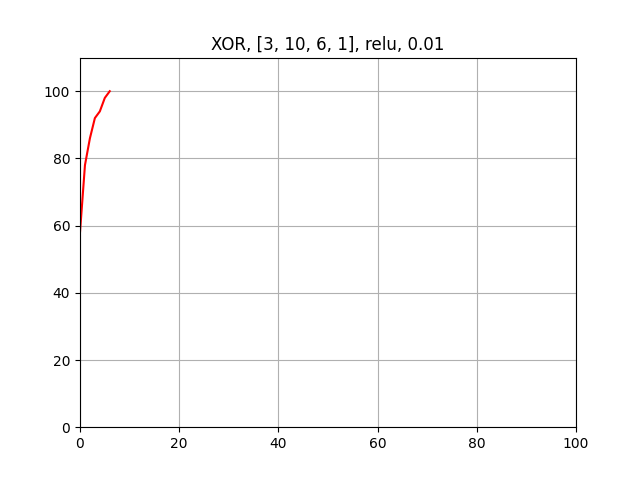
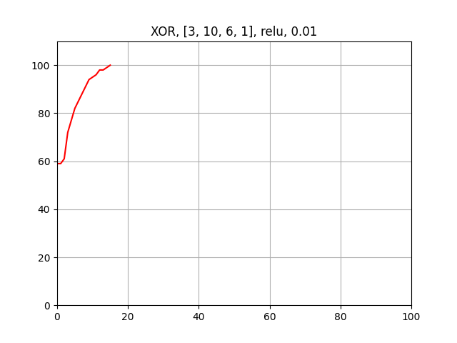
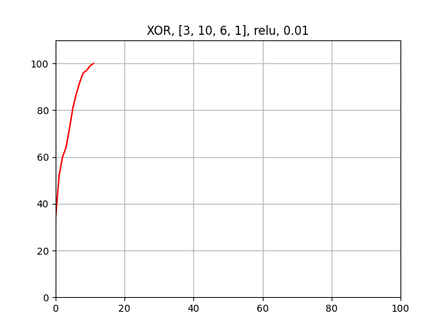
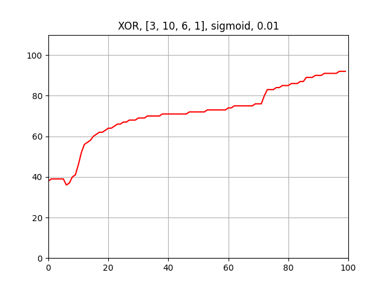
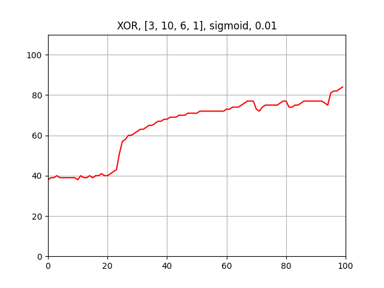
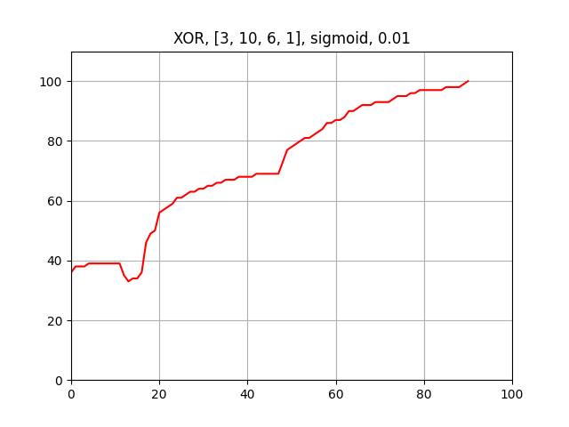

# neural_test

## Description

An attempt to make a neural network from scratch.

There are only standard layers(no convolutional) and two activation functions: sigmoid and relu

The end activation function is sigmoid, so the output is in range `[0, 1]`.

There is ability to save and load model and preview the efficiency in real time.

## Installation

If using `pdm`:

```bash
pdm install
```

If just `pip`:

```bash
pip install -r requirements.txt
pip install -e .
```

## Usage

The example usage is presented in `xor.py`, if training and `load_xor.py` if loading the model.

### Training

#### Create inputs and outputs

They should both be 2D arrays(even if only one input or output), where each row is a single example.

```python
import numpy as np

inputs = np.array([[0, 0], [0, 1], [1, 0], [1, 1]])
outputs = np.array([[0], [1], [1], [0]])
```

#### Create a network

```python
from neural.network import Network

network = Network(layers, activation_function, learn_rate)
```

`layers` is a list of integers, where each integer is the number of neurons in the layer.

For example `[2, 3, 1]` means that there are 2 neurons in the input layer, 3 in the hidden layer and 1 in the output layer.

`activation_function` is a string, either `sigmoid` or `relu`.

`learn_rate` is a float, the learning rate of the network. Default is `0.1`.

#### Train the network

```python
network.generate_weights_and_biases()  # Generate random weights and biases
```

Now for every input and output pair, you can train the network:

```python
network.forward(single_input)  # Forward propagate
network.backward(single_desired_output)  # Backward propagate
```

It will automatically update the weights and biases accordingly.

If you want to change weights and biases randomly a bit, because the network is stuck, you can do it by calling:

```python
network.adjust_weights_and_biases()
```

### Save the network

```python
network.save("name")
```

It will save the network in `./name/` directory.

### Load the network

```python
network = Network.load("name")
```

It will load the network from `./name/` directory.

Now you can call `network.forward(single_input)` to get the output.

### Preview the efficiency in real time

```python
from neural.dynamic_plot import DynamicPlot

plot = DynamicPlot((0, LENGTH), (0, 110))
```

`LENGTH` is the number of iterations you want to train the network for.

`110` is just a bit more than 100% in order to have some space for the plot.

Now, after every iteration, you can call:

```python
plot.update(iteration, correctness)
```

To calculate correctness, you can update the plot every `n` iterations and calculate `correct/n`

At the end, call:

```python
plot.show()
```

to keep the plot open.

## The reversed XOR example

The example is in `xor.py` and `load_xor.py`.

To test the network, I used the reversed XOR function for 3 numebrs.

It takes 3 numbers in `{0,1}` and returns `1` only if there are two `1` of three numbers.

For example: `[0, 1, 1]` returns `1`, but `[1, 1, 1]`, `[0, 1, 0]` and `[0, 0, 0]` return `0`.

There are 10000 iterations, and every 100 iterations the correctness is calculated and plotted.

The accuracy for every iteration was calculated as:

- `1` - if the difference is less than `0.1`
- `1 - (desired_output - output)` - if the difference is less than `0.5`
- `0` - otherwise

The total for every `100` iterations was calculated as a sum of all accuracies divided by `100`.

When the accuracy is `100%`, the training stops.

At the end, the network is saved in `./xor/` directory.

### The plot

It differs every time, because the starting weights and biases are generated randomly.

Here are some examples:

The titles are in the format: `XOR, layers, activation function, learn rate`

---





---





---

As we can see, in this case, `relu` is better than `sigmoid` for hidden layers.